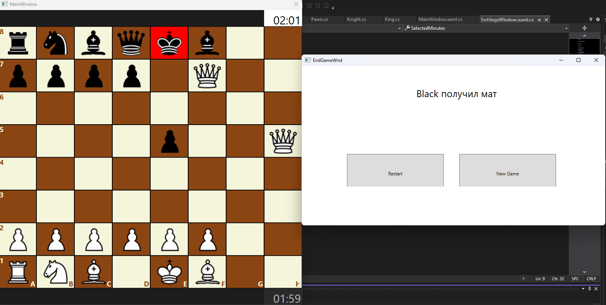
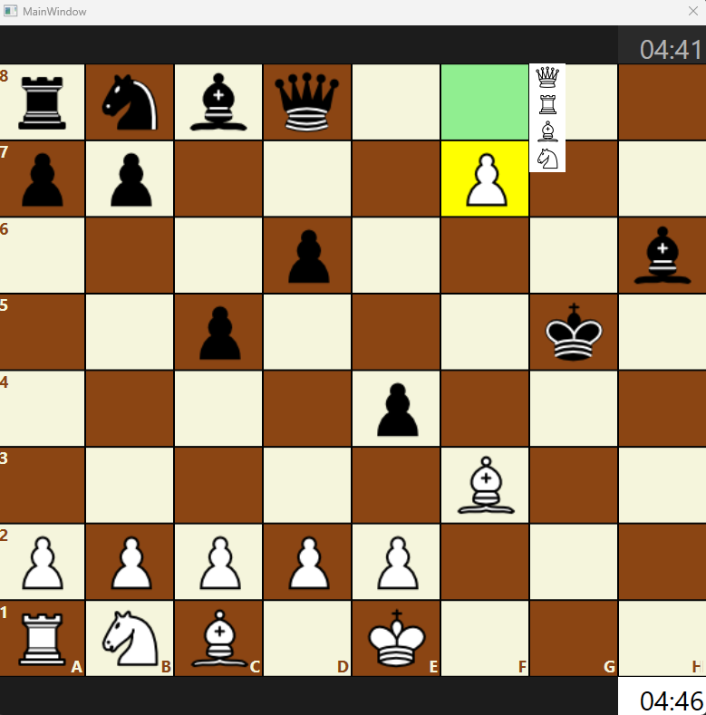

# Chess Game with Basic AI (C# WPF)

**Technologies:** C#, WPF 

**Description:**  
A simple Chess desktop application with a basic AI opponent.  
Players can play against each other or against the computer with easy difficulty.

**Screenshot:**  

